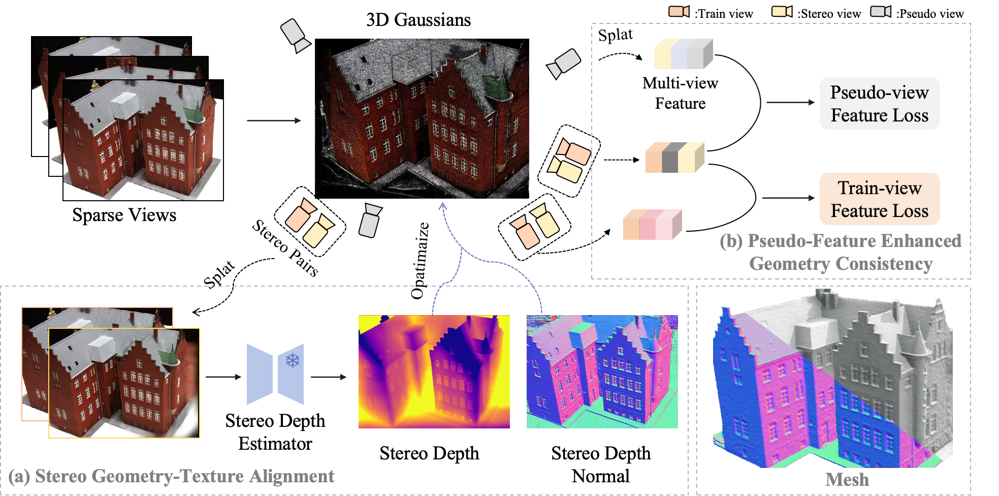

<div align="center">

# SparseSurf: Sparse-View 3D Gaussian Splatting for Surface Reconstruction

[Meiying Gu](https://scholar.google.com/citations?user=9WT89kAAAAAJ&hl=zh-CN) · [Jiawei Zhang](https://jiaw-z.github.io/) · [Jiahe Li](https://fictionarry.github.io/) · [Xiaohan Yu](https://xiaohanyu-gu.github.io/) · [Haonan Luo](https://scholar.google.com/citations?user=NZRs4FkAAAAJ&hl=zh-CN) · [Jin Zheng](https://openreview.net/profile?id=~Jin_Zheng1) · [Xiao Bai](https://scholar.google.com/citations?user=k6l1vZIAAAAJ&hl=en)

**AAAI 2026**

[Paper](https://arxiv.org/pdf/2511.14633) | [arXiv](https://arxiv.org/abs/2511.14633) | [Project Page](https://miya-oi.github.io/SparseSurf-project/) | [Video](https://youtu.be/0oGb1i0Qr2w)

</div>

<p align="center">
  
</p>

SparseSurf reconstructs accurate and detailed surfaces from sparse views while preserving high-quality novel-view rendering. Our framework combines Stereo Geometry-Texture Alignment with Pseudo-Feature Enhanced Geometry Consistency, including pseudo-view feature consistency and train-view feature alignment.

## Installation

Tested with Python `3.8`, PyTorch `2.4.1`, and CUDA `11.8`.

```bash
git clone --recursive https://github.com/miya-oi/SparseSurf.git
cd SparseSurf
```

Create the conda environment:

```bash
conda env create -f environment.yml
conda activate sparsesurf
```

## Required Data

```text
/data
├── DTU_fatesgs
│   ├── <set_name, e.g. set_23_24_33>
│   │   ├── <scan_name, e.g. scan24>
│   │   │   ├── pair.txt
│   │   │   ├── images
│   │   │   │   ├── 0000.png
│   │   │   │   ├── 0001.png
│   │   │   │   ├── ...
│   │   │   ├── sparse
│   │   │   │   ├── 0
│   │   │   │   │   ├── cameras.txt
│   │   │   │   │   ├── images.txt
│   │   │   │   │   ├── points3D.txt
│   │   │   ├── dense
│   │   │   │   ├── fused.ply
│   │   │   │   ├── ...
├── DTU
│   ├── Rectified
│   │   ├── scan1
│   │   ├── scan2
│   │   ├── ...
│   ├── submission_data
│   │   ├── scan24
│   │   │   ├── images
│   │   │   ├── mask
│   │   │   ├── sparse
│   │   │   │   ├── 0
│   │   │   ├── 3_views
│   │   │   │   ├── pair.txt
│   │   │   │   ├── dense
│   │   │   │   │   ├── fused.ply
│   │   ├── ...
```

## Evaluation

### DTU_mesh

1. Download the processed sparse-view DTU dataset from [FatesGS](https://github.com/yulunwu0108/FatesGS) or its [Google Drive](https://drive.google.com/drive/folders/143jIT9DJN17gigp3uxBtqBv6UBdcO7Lm).
2. Generate `pair.txt` if needed:

```bash
python tools/colmap2mvsnet.py \
  --dense_folder /path/to/DTU/scan24 \
  --max_d 256 \
  --convert_format \
  --pair_path /path/to/DTU/scan24/pair.txt
```

3. Set `FOUNDATION_STEREO_CKPT` once as in `Running`, then run:

```bash
python scripts/run_dtu_mesh.py /path/to/DTU_fatesgs/set_23_24_33/scan24 ./outputs/dtu_mesh/scan24 ${gpu_id} /path/to/dtu_2dgs/DTU/SampleSet/MVS_Data --mask_root /path/to/dtu_2dgs/DTU
```

`--mask_root /path/to/dtu_2dgs/DTU` matches the common 2DGS-style DTU evaluation layout:
`/path/to/dtu_2dgs/DTU/scan24/mask` for culling masks and
`/path/to/dtu_2dgs/DTU/SampleSet/MVS_Data` for the official mesh evaluation target.

### DTU_NVS

1. Organize DTU following [DNGaussian](https://github.com/Fictionarry/DNGaussian) or [CoR-GS](https://github.com/jiaw-z/CoR-GS), using the `3_views` setting.
2. Generate `3_views/pair.txt`:

```bash
python tools/colmap2mvsnet.py \
  --dense_folder /path/to/DTU/scan24 \
  --max_d 256 \
  --convert_format \
  --pair_path /path/to/DTU/scan24/3_views/pair.txt
```

3. Set `FOUNDATION_STEREO_CKPT` once as in `Running`, then run:

```bash
bash scripts/run_dtu_nvs.sh ${gpu_id} scan24 ./outputs/dtu_nvs/scan24
```

Prepare evaluation masks under `<model_path>/mask`, renders the test views, and then compute mask-aware `PSNR/SSIM/LPIPS`.

## Running


### Training

```bash
CUDA_VISIBLE_DEVICES=0 python train.py \
  -s <source_path> \
  -m <model_path> \
  -r <resolution>
```

Add `--n_views 3` for DTU NVS.

### Mesh extraction

```bash
CUDA_VISIBLE_DEVICES=0 python extract_mesh.py \
  -s <source_path> \
  -m <model_path> \
  -r <resolution> \
  --skip_test
```

### Rendering

```bash
CUDA_VISIBLE_DEVICES=0 python render.py \
  -m <model_path> \
  --skip_train
```

## Citation

```bibtex
@inproceedings{gu2026sparsesurf,
  title={SparseSurf: Sparse-View 3D Gaussian Splatting for Surface Reconstruction},
  author={Gu, Meiying and Zhang, Jiawei and Li, Jiahe and Yu, Xiaohan and Luo, Haonan and Zheng, Jin and Bai, Xiao},
  booktitle={Proceedings of the AAAI Conference on Artificial Intelligence},
  volume={40},
  number={6},
  pages={4311--4319},
  year={2026}
}
```

## Acknowledgement

We thank the authors of [Gaussian Splatting](https://github.com/graphdeco-inria/gaussian-splatting), [2D Gaussian Splatting](https://github.com/hbb1/2d-gaussian-splatting), [PGSR](https://github.com/zju3dv/PGSR), [FoundationStereo](https://github.com/NVlabs/FoundationStereo/), [FatesGS](https://github.com/yulunwu0108/FatesGS), [DNGaussian](https://github.com/Fictionarry/DNGaussian), and [CoR-GS](https://github.com/jiaw-z/CoR-GS) for releasing their code and data resources.
